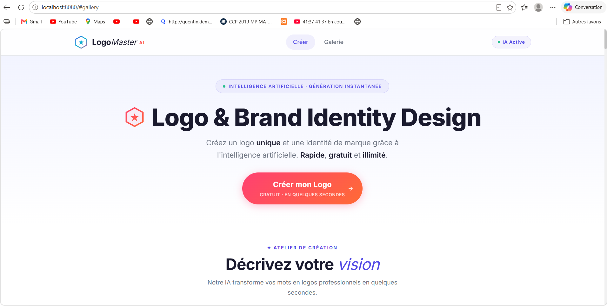
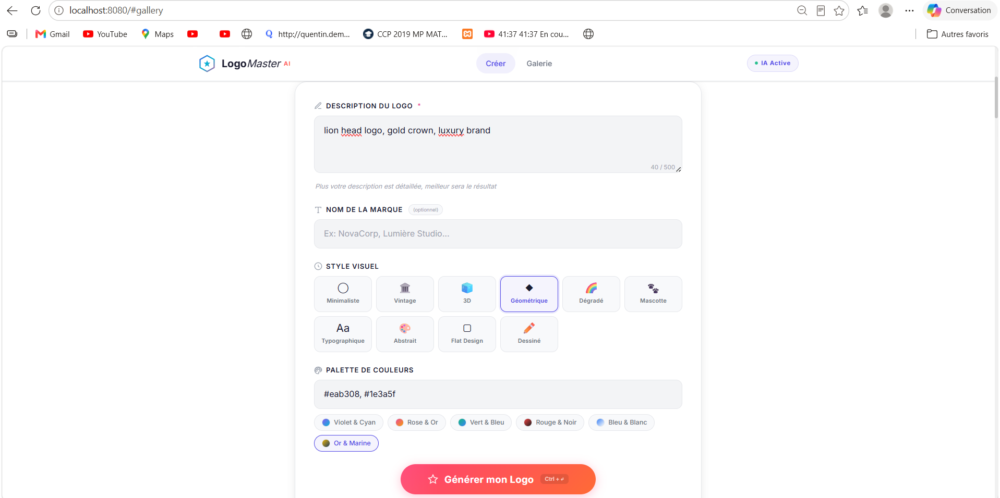
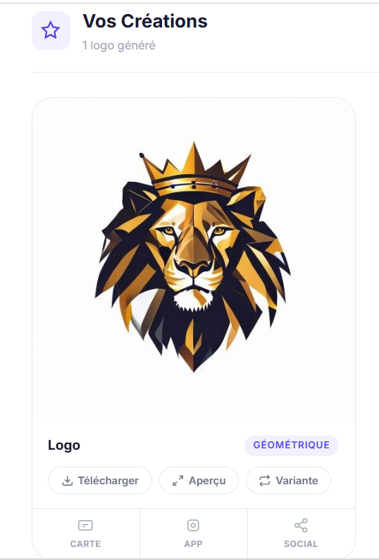
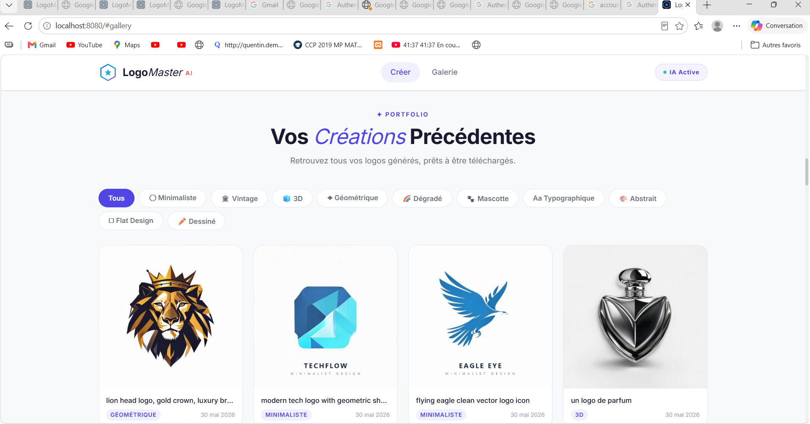

<div align="center">

# 🎨 LogoMaster AI

### Application IA pour Création de Logos et Designs

[](https://python.org)
[](https://flask.palletsprojects.com)
[](https://huggingface.co/stabilityai/stable-diffusion-xl-base-1.0)
[](LICENSE)

**Créez des logos professionnels uniques grâce à l'intelligence artificielle générative**

[🚀 Démo](#démonstration) • [📦 Installation](#installation) • [🛠️ Technologies](#technologies-utilisées) • [📖 Guide](#guide-dutilisation)

</div>

---

## 👥 Réalisé par

| Nom | Rôle |
|-----|------|
| **Med Aziz Hmani** | 2eme année DAD |
| **Med Aziz Torjmen** | 2eme année EAN |

---

## 📋 Description

**LogoMaster AI** est une application web complète permettant de générer des logos et designs professionnels à l'aide de **Stable Diffusion XL**, un modèle d'IA générative basé sur la diffusion (Diffusion Model / Transformer).

L'application offre une interface web moderne et intuitive où les utilisateurs peuvent :
- Décrire le logo souhaité en langage naturel
- Choisir parmi 10 styles visuels différents
- Personnaliser les couleurs
- Générer jusqu'à 4 variations simultanément
- Gérer une galerie de toutes les créations

---

## 🤖 Modèle d'IA Utilisé

| Critère | Détail |
|---------|--------|
| **Modèle** | [Stable Diffusion XL Base 1.0](https://huggingface.co/stabilityai/stable-diffusion-xl-base-1.0) |
| **Type** | Modèle de Diffusion (Latent Diffusion Model) |
| **Architecture** | U-Net + Transformer + VAE |
| **Fournisseur** | Stability AI via Hugging Face Inference API |
| **Utilisation** | Génération d'images (Text-to-Image) |

> Le modèle utilise un processus de **diffusion inverse** : partant d'un bruit aléatoire, il le transforme progressivement en image cohérente guidée par le prompt textuel de l'utilisateur.

---

## 🛠️ Technologies Utilisées

### Backend
- **Python 3.10+** — Langage principal
- **Flask 3.1** — Framework web
- **Hugging Face Hub** — Client API pour Stable Diffusion
- **Pillow** — Traitement d'images
- **Pydantic** — Validation des données

### Frontend
- **HTML5** — Structure sémantique
- **CSS3** — Design premium (Glassmorphism, animations, dark mode)
- **JavaScript (ES6+)** — Logique client (vanilla, sans framework)
- **Google Fonts** — Typographie (Inter, Outfit)

### IA Générative
- **Stable Diffusion XL** — Modèle de diffusion pour la génération d'images
- **Prompt Engineering** — Optimisation automatique des prompts pour la génération de logos

---

## 📸 Captures d'écran

### Page d'accueil & Formulaire de génération




### Résultats de génération


### Galerie


---

## 🎬 Démonstration
https://github.com/azizhmani42/projet-IA-enstab/blob/main/screenshots/démo_courte.mp4


---

## 📦 Installation

### Prérequis

- **Python 3.10+** installé sur votre machine
- Un **token Hugging Face** gratuit ([créer un compte](https://huggingface.co/join) → [générer un token](https://huggingface.co/settings/tokens))

### Étapes d'installation

#### 1. Cloner le dépôt

```bash
git clone https://github.com/votre-username/logoforge-ai.git
cd logoMaster-ai
```

#### 2. Créer un environnement virtuel

```bash
python -m venv venv

# Windows
venv\Scripts\activate

# Linux/Mac
source venv/bin/activate
```

#### 3. Installer les dépendances

```bash
pip install -r backend/requirements.txt
```

#### 4. Configurer la clé API

```bash
# Copier le fichier template
cp .env.example .env

# Éditer .env et remplacer par votre token Hugging Face
# HF_API_TOKEN=hf_votre_vrai_token_ici
```

#### 5. Lancer l'application

```bash
python backend/app.py
```

#### 6. Ouvrir dans le navigateur

```
http://localhost:8080
```

---

## 📖 Guide d'Utilisation

### 1. Décrire votre logo
Saisissez une description en langage naturel dans le champ de texte. Soyez précis pour obtenir de meilleurs résultats.

**Exemples de prompts :**
- *"Un logo moderne pour une startup tech avec un éclair"*
- *"Logo élégant pour un restaurant français avec une tour Eiffel"*
- *"Logo minimaliste pour une application de fitness avec un cœur"*

### 2. Choisir un style
Sélectionnez parmi les 10 styles disponibles :

| Style | Description |
|-------|-------------|
| ◎ Minimalist | Design épuré et simple |
| 🏛️ Vintage | Style rétro et classique |
| 🧊 3D | Rendu tridimensionnel |
| ◆ Geometric | Formes géométriques |
| 🌈 Gradient | Dégradés de couleurs |
| 🐾 Mascot | Personnage mascotte |
| **Aa** Typographic | Focalisé sur la typographie |
| 🎨 Abstract | Formes abstraites |
| ▢ Flat | Design plat moderne |
| ✏️ Hand-drawn | Style dessiné à la main |

### 3. Personnaliser les couleurs
Entrez vos couleurs souhaitées (ex: "bleu et or") ou utilisez les palettes prédéfinies.

### 4. Générer
Cliquez sur **"🚀 Générer mon Logo"** et attendez quelques secondes.

### 5. Télécharger
Cliquez sur le bouton de téléchargement pour sauvegarder vos logos en PNG haute résolution.

---

## 🏗️ Architecture du Projet

```
logoforge-ai/
├── backend/
│   ├── app.py                 # Point d'entrée Flask
│   ├── config.py              # Configuration
│   ├── requirements.txt       # Dépendances Python
│   ├── models/
│   │   └── schemas.py         # Schémas Pydantic
│   ├── routes/
│   │   └── api.py             # Routes API REST
│   └── services/
│       └── generator.py       # Service IA de génération
├── frontend/
│   ├── index.html             # Page principale
│   ├── css/
│   │   └── style.css          # Styles premium
│   ├── js/
│   │   ├── api.js             # Client API
│   │   ├── app.js             # Logique principale
│   │   └── gallery.js         # Gestion galerie
│   └── assets/
│       └── favicon.svg        # Favicon
├── generated/                 # Logos générés (gitignored)
├── .env.example               # Template configuration
├── .gitignore
└── README.md
```

---

## 🔌 API Endpoints

| Méthode | Endpoint | Description |
|---------|----------|-------------|
| `POST` | `/api/generate` | Générer des logos |
| `GET` | `/api/gallery` | Lister la galerie |
| `GET` | `/api/images/:filename` | Servir une image |
| `DELETE` | `/api/images/:id` | Supprimer un logo |
| `GET` | `/api/styles` | Lister les styles |

---

## 📄 Licence

Ce projet est sous licence MIT. Voir le fichier [LICENSE](LICENSE) pour plus de détails.

---

<div align="center">

**Fait par Med Aziz Hmani & Med Aziz Torjmen**

*Projet IA — 2025*

*Propulsé par Stable Diffusion XL*

</div>
